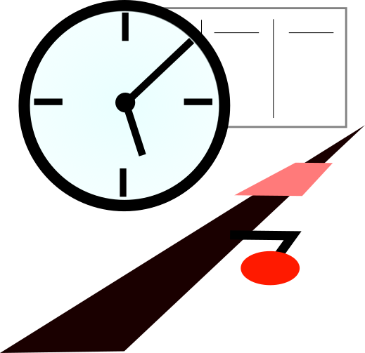

# Railway Operation Simulator Timetable Editor

Welcome to the main documentation site for the [Railway Operation Simulator Timetable Editor](https://github.com/Railway-Op-Sim/ROSTimetableEditor) by the [Railway Operation Simulator development team](https://github.com/Railway-Op-Sim). The purpose of this application is to complement the brilliant [Railway Operation Simulator](https://www.railwayoperationsimulator.com/) by Albert Ball, offering various "smart" features to simplify the process of timetable creation via a user interface.

Development Team

- Kristian Zarebski (Lead Programmer and Designer)
- Albert Ball (Testing and Development)
- Daniel Gill (Documentation and Testing)
