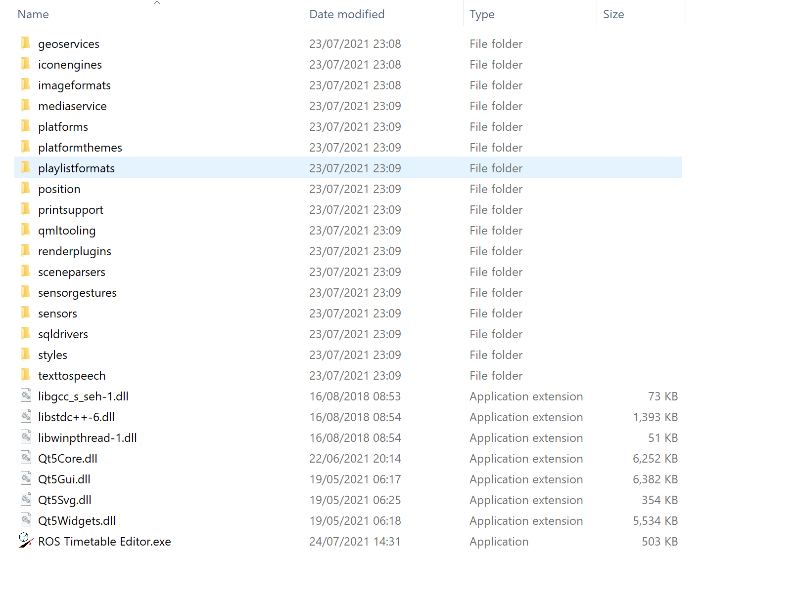

# Installation

ROSTTBEditor has been confirmed to work under Windows 10. To install simply download the latest release from the [GitHub repository](https://github.com/Railway-Op-Sim/ROSTimetableEditor/releases) and place in a user accessible location. To launch the program simply run the included executable.

