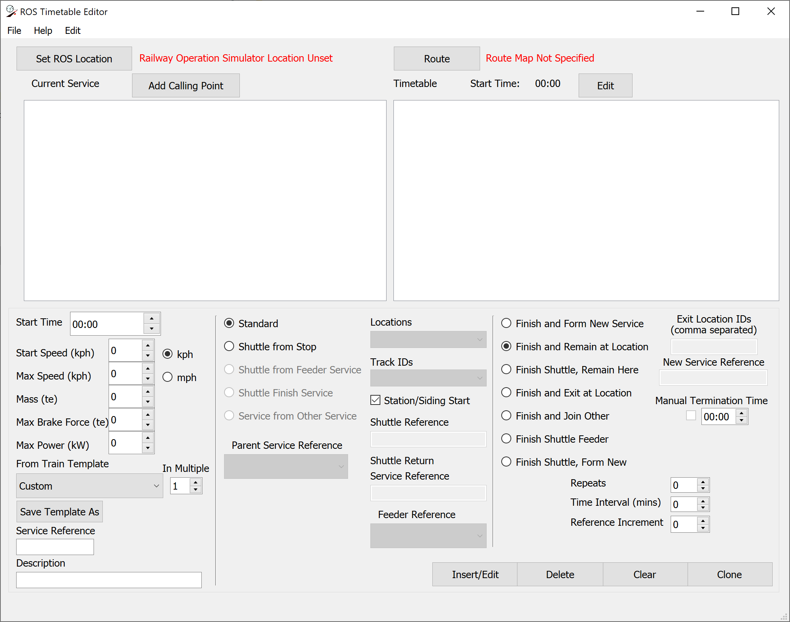
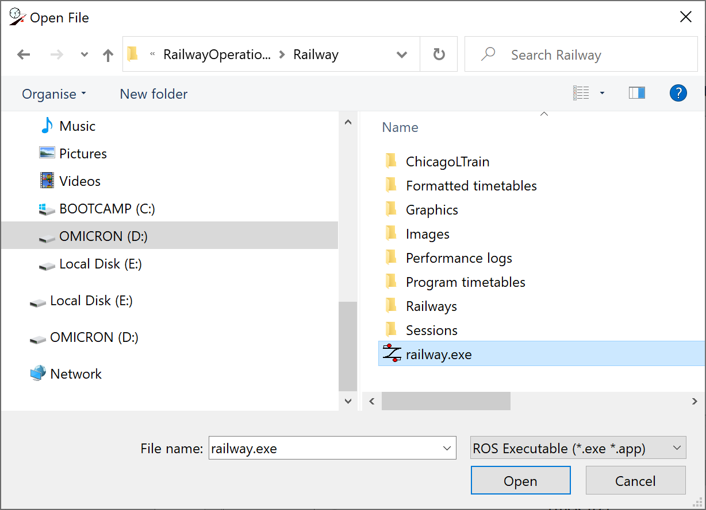
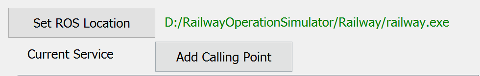
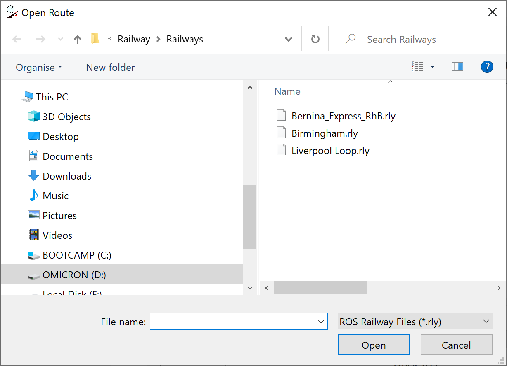

# Quickstart

This guide provides a quick start overview of how to use the application interface. 

When opened ROSTTBEditor presents the user with a single window with two main view panels and a series of options relating to customisation and creation of services.

 

 

## Setup

Firstly the application must be directed to a local installation of Railway Operation Simulator. This allows the program to quickly display timetables and routes within the program's folders when opening files:

* Click the `Set ROS Location` button.
* Browse for the `railway.exe` executable within your Railway Operation Simulator installation.
* Click `Open`.

 

 

When the executable has been successfully set the address will appear at the top of the window:

 

 

## Opening a Railway

To create a timetable you must first load the timetable for the route to be simulated:

* Click the `Route` button.
* Browse for the route `.rly` file.
* Click `Open`.
  
 

 

## Creating a Timetable

When the application is opened a new timetable is already loaded, however to start the creation from scratch go to `File > New`.